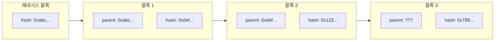
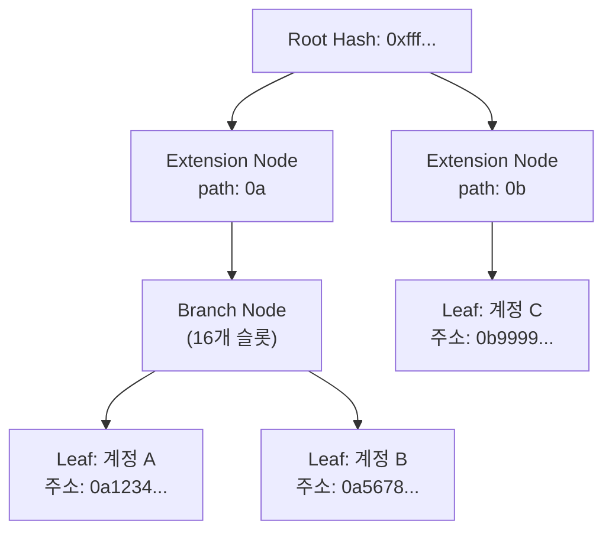

# Week 4 Quiz: Network/Block + wagmi

> **제출 방법:** 이 파일을 복사하여 답변을 작성한 후, PR로 제출하세요.
> **평가 기준:** 개념 이해도 중심 - 문법 오류보다 논리적 설명을 중시합니다.

---

## 문제 1: 블록 헤더 필드 (객관식)

다음 상황을 고려하세요:

```
블록 100의 해시: 0xabc123...
블록 101의 해시: 0xdef456...
```

블록 101의 `parentHash` 필드에는 어떤 값이 저장되어 있나요? 그리고 **왜** 이런 방식으로 연결하나요?

**보기:**
A) 0xdef456... - 자기 자신의 해시를 저장하여 무결성을 보장한다
B) 0xabc123... - 이전 블록의 해시를 저장하여 체인 연결과 불변성을 보장한다
C) 블록 번호 100 - 숫자로 순서를 추적한다
D) 빈 값 - 헤더에는 해시가 저장되지 않는다

**답변:**
<!--
정답 알파벳과 왜 이 답을 선택했는지 설명하세요.
다른 보기가 왜 틀린지도 간략히 설명해 주세요.
-->
B
A - 자기 자신의 해시를 저장하는 필드가 아니다
C - number 필드에서 숫자로 순서를 추적하는 것은 맞지만 parentHash에 저장되진 않는다
D - 그렇지 않다

---

## 문제 2: MPT 목적 (객관식)

이더리움에서 Merkle Patricia Trie(MPT)를 사용하는 **가장 중요한 이유**는 무엇인가요?

**보기:**
A) 데이터를 암호화하여 외부에서 읽을 수 없게 한다
B) 트랜잭션 처리 속도를 10배 이상 높인다
C) 전체 데이터 없이도 특정 데이터의 존재와 정확성을 효율적으로 증명한다
D) 블록 크기를 줄여서 저장 공간을 절약한다

**답변:**
<!--
정답 알파벳과 왜 이 기능이 중요한지 설명하세요.
Light Node와 연결지어 설명하면 더 좋습니다.
-->
C
이더리움은 전체 상태 데이터를 모두 가지고 있지 않아도 특정 계정의 상태가 맞는지 효율적으로 검증하기 위해서 MPT를 사용한다.
이는 해시 함수로 구현(Merkle Tree)되며 Patricia Trie를 사용하는 이유는 효율적으로 key, value를 저장하기 위해서이다.
특히 Light Node는 전체 상태를 저장하지 않고, 블록 헤더에 포함된 state root와 해당 데이터에 대한 Merkle proof만으로 필요한 데이터가 실제 상태에 포함되어 있는지 검증할 수 있다.
---

## 문제 3: 체인 연결과 보안 (객관식)

공격자가 블록 50의 트랜잭션을 수정하려고 합니다. 현재 체인의 최신 블록은 100입니다. 이 공격이 **왜** 어려운가요?

**보기:**
A) 블록 50은 너무 오래되어서 시스템에서 접근할 수 없다
B) 블록 50을 수정하면 해시가 바뀌고, 블록 51부터 100까지 모든 블록의 parentHash가 불일치하게 된다
C) 블록 50은 이미 암호화되어 있어서 복호화 키가 필요하다
D) 네트워크 관리자만 과거 블록을 수정할 수 있다

**답변:**
<!--
정답 알파벳과 블록체인의 불변성이 어떻게 작동하는지 설명하세요.
-->
B
블록 50의 트랜잭션을 수정하면 블록 50의 블록 헤더와 해시가 달라지게 된다.
그러면 블록 51의 parentHash가 더 이상 블록 50의 새로운 해시와 일치하지 않게 되고, 같은 문제가 연쇄적으로 블록 52, 53, …, 100까지 모두 발생한다.
즉 과거 블록 하나를 바꾸려면 그 뒤의 모든 블록을 다시 생성해야하므로 매우 어렵다.
---

## 문제 4: MPT 진화 과정 (단답형)

MPT(Merkle Patricia Trie)는 세 가지 자료구조의 장점을 결합한 것입니다:
1. **Trie** -> 2. **Patricia Trie** -> 3. **Merkle Patricia Trie**

**왜** 각 단계의 발전이 필요했나요? 각 단계가 해결하는 문제를 간단히 설명하세요.

**답변:**
<!--
1. Trie가 해결하는 문제:

2. Patricia Trie가 해결하는 문제 (Trie의 한계):

3. Merkle Patricia Trie가 해결하는 문제 (Patricia Trie의 한계):

-->
1. Trie가 해결하는 문제:

Trie는 key를 문자 단위로 따라가며 저장하므로, key, value 데이터를 체계적으로 저장하고 빠르게 탐색할 수 있게 해준다.
즉 많은 계정 주소나 storage key를 공통 prefix 기준으로 정리하여 효율적으로 조회할 수 있다.

2. Patricia Trie가 해결하는 문제 (Trie의 한계):
기본 Trie는 key들이 길고 sparse하면 중간 노드가 너무 많이 생겨 메모리 낭비와 비효율이 커진다.
Patricia Trie는 경로 압축을 통해 불필요한 중간 노드를 줄여 더 적은 공간으로 같은 key들을 저장할 수 있게 한다.

3. Merkle Patricia Trie가 해결하는 문제 (Patricia Trie의 한계):

Patricia Trie만으로는 데이터가 위변조되지 않았는지 효율적으로 검증하기 어렵다.
Merkle Patricia Trie는 각 노드에 해시를 연결하여 루트 해시 하나로 전체 상태를 대표하게 만들고, 특정 데이터에 대해서도 Merkle proof를 통해 정확성을 검증할 수 있게 한다.

---

## 문제 5: Eclipse Attack 방어 (단답형)

Eclipse Attack은 공격자가 피해자 노드의 **모든 피어 연결**을 자신이 통제하는 노드로 바꾸는 공격입니다.

1) 이 공격이 성공하면 피해자에게 **어떤 피해**가 발생할 수 있나요?
2) 개인 노드 운영자가 이 공격을 **방어**하기 위해 할 수 있는 행동은 무엇인가요?

**답변:**
<!--
1) 가능한 피해 (2가지 이상):


2) 방어 방법 (2가지 이상):

-->

1) 가능한 피해 (2가지 이상):

공격이 성공하면 피해자 노드는 네트워크의 정상적인 정보와 차단된 상태가 되어, 가짜로 지연된 블록 정보를 받거나 최신 체인 상태를 제대로 보지 못할 수 있다.
그 결과 피해자는 잘못된 체인을 믿고 채굴이나 검증을 하게 될 수 있고, 특정 트랜잭션이 확인된 것처럼 속아 double spending 같은 공격에 노출될 수도 있다.
또한 다른 정상 노드들과 단절되므로 네트워크 전체 관점에서 고립되어 합의 알고리즘의 품질이 크게 떨어질 수 있다.

2) 방어 방법 (2가지 이상):
개인 노드 운영자는 피어를 다양하게 유지해서 한 공격자가 모든 연결을 장악하기 어렵게 해야 한다.
예를 들어 서로 다른 IP 대역이나 서로 다른 지역의 피어와 연결하는 것이 도움이 된다.
또한 고정된 trusted peer 일부를 직접 설정하거나 소수의 피어에만 계속 연결되는 상황을 점검하는 것도 중요하다.
---

## 문제 6: 노드 종류 선택 (단답형)

친구가 이더리움 개발을 시작하려고 합니다. 다음 세 가지 상황에서 각각 어떤 노드 타입(Full, Light, Archive)을 추천하시겠습니까? **왜** 그 노드를 추천하는지도 설명하세요.

1) 모바일 지갑 앱 개발
2) 블록체인 데이터 분석 서비스 개발
3) 일반적인 dApp 백엔드 개발

**답변:**
<!--
1) 모바일 지갑 앱:
   추천 노드:
   이유:

2) 블록체인 데이터 분석:
   추천 노드:
   이유:

3) dApp 백엔드:
   추천 노드:
   이유:
-->

1) 모바일 지갑 앱:
추천 노드: Light Node
이유: 모바일 환경은 저장공간과 네트워크 자원이 제한적이므로, 전체 체인을 저장하지 않고 필요한 데이터만 검증하는 Light Node가 적합하다.

2) 블록체인 데이터 분석:
추천 노드: Archive Node
이유: 과거 모든 상태와 히스토리 데이터까지 필요하므로, 오래된 state 조회가 가능한 Archive Node가 적합하다.

3) 일반적인 dApp 백엔드:
추천 노드: Full Node
이유: 일반적인 트랜잭션 처리와 최신 상태 조회에는 Full Node면 충분하고, Archive Node보다 비용이 적게 든다.
Light Node로도 가능은 하지만,
---

## 문제 7: useAccount Hook (빈칸 채우기)

다음 코드의 빈칸을 채워서 지갑 연결 상태를 표시하는 컴포넌트를 완성하세요:

```typescript
import { _________________ } from 'wagmi';

function WalletStatus() {
  // TODO: useAccount hook에서 필요한 값들을 가져오세요
  const { _________________, _________________ } = useAccount();

  if (!isConnected) {
    return <div>지갑이 연결되지 않았습니다</div>;
  }

  return (
    <div>
      <p>연결된 주소: {address}</p>
    </div>
  );
}
```

**답변:**
```typescript
// 완성된 코드를 여기에 작성하세요
import { useAccount } from 'wagmi';

function WalletStatus() {
  // TODO: useAccount hook에서 필요한 값들을 가져오세요
  const { address, isConnected } = useAccount();

  if (!isConnected) {
    return <div>지갑이 연결되지 않았습니다</div>;
  }

  return (
    <div>
      <p>연결된 주소: {address}</p>
    </div>
  );
}
```

**왜 이렇게 작성했나요:**
<!--
useAccount hook이 제공하는 값들과 각각의 역할을 설명하세요.
-->
useAccount hook은 현재 연결된 지갑의 address와 연결 여부인 isConnected 상태를 제공한다.
이를 이용해 지갑이 연결되지 않았을 때는 안내 메시지를 보여주고, 연결되었을 때는 주소를 화면에 표시하도록 구현했다.
---

## 문제 8: useReadContract Hook (빈칸 채우기)

다음 코드의 빈칸을 채워서 컨트랙트의 `getCount` 함수 결과를 화면에 표시하세요:

```typescript
import { useReadContract } from 'wagmi';

const counterABI = [
  {
    name: 'getCount',
    type: 'function',
    stateMutability: 'view',
    inputs: [],
    outputs: [{ name: 'count', type: 'uint256' }],
  },
] as const;

function CountDisplay() {
  const { data, isLoading, error } = useReadContract({
    // TODO: 필요한 설정을 채우세요
    address: '0x1234...5678',
    _________________,
    _________________,
  });

  if (isLoading) return <div>로딩 중...</div>;
  if (error) return <div>에러 발생</div>;

  return <div>현재 카운트: {_________________}</div>;
}
```

**답변:**
```typescript
// 완성된 코드를 여기에 작성하세요
import { useReadContract } from 'wagmi';

const counterABI = [
  {
    name: 'getCount',
    type: 'function',
    stateMutability: 'view',
    inputs: [],
    outputs: [{ name: 'count', type: 'uint256' }],
  },
] as const;

function CountDisplay() {
  const { data, isLoading, error } = useReadContract({
    // TODO: 필요한 설정을 채우세요
    address: '0x1234...5678',
    abi: counterABI,
    functionName: 'count',
  });

  if (isLoading) return <div>로딩 중...</div>;
  if (error) return <div>에러 발생</div>;

  return <div>현재 카운트: {data}</div>;
}
```

**왜 이렇게 작성했나요:**
<!--
useReadContract의 필수 설정 항목과 data를 화면에 표시할 때 주의할 점을 설명하세요.
-->
useReadContract는 컨트랙트의 읽기 함수 호출을 위해 abi와 호출할 함수 이름(functionName)을 설정해야 한다.
호출 결과는 data에 반환되므로 이를 화면에 출력하여 현재 카운트 값을 표시한다.
---

## 문제 9: useWriteContract 버그 (취약점 찾기)

다음 코드에서 **문제점**을 찾고 수정하세요:

```typescript
// BAD CODE - 문제점 찾기
import { useWriteContract } from 'wagmi';

function IncrementButton() {
  const { writeContract, isPending } = useWriteContract();

  const handleClick = () => {
    // 문제가 있는 코드
    writeContract({
      address: '0x1234...5678',
      functionName: 'increment',
      // abi가 없음!
    });
  };

  return (
    <button onClick={handleClick} disabled={isPending}>
      증가하기
    </button>
  );
}
```

**1) 발견한 문제점:**
<!--
무엇이 빠졌거나 잘못되었는지 설명하세요.
-->
writeContract 호출 시 컨트랙트의 함수 정보를 알기 위한 abi가 빠져 있다.

**2) 왜 이것이 문제인가:**
<!--
이 문제가 어떤 오류나 동작 이상을 일으키는지 설명하세요.
-->
ABI가 없으면 wagmi가 increment 함수의 시그니처를 알 수 없어 트랜잭션 데이터를 인코딩하지 못하고 호출이 실패한다.

**3) 올바른 수정 방법:**
```typescript
// GOOD CODE - 수정된 버전을 작성하세요
import { useWriteContract } from 'wagmi';

function IncrementButton() {
  const { writeContract, isPending } = useWriteContract();

  const handleClick = () => {
    // 문제가 있는 코드
    writeContract({
      address: '0x1234...5678',
      abi: counterABI,
      functionName: 'increment',
    });
  };

  return (
    <button onClick={handleClick} disabled={isPending}>
      증가하기
    </button>
  );
}
```

---

## 문제 10: 블록 연결 구조 (다이어그램 해석)

다음 다이어그램은 블록체인의 연결 구조를 보여줍니다:



**질문:**

1) 블록 3의 `parent: ???` 에 들어갈 값은 무엇인가요?
0x123

2) 만약 블록 1의 내용이 수정되면, 블록 2와 블록 3에 **어떤 영향**이 있나요? 왜 그런가요?
블록 1의 내용이 수정되면 블록 1의 해시가 바뀌게 되고, 블록 2의 parentHash가 더 이상 일치하지 않게 된다.
그 결과 블록 2와 블록 3까지 모두 해시와 연결이 깨지므로 이후 블록들을 모두 다시 생성해야 한다.

3) 제네시스 블록(블록 0)의 parentHash는 어떤 특별한 값을 가지나요? 왜 그런가요?
제네시스 블록의 parentHash는 보통 0x000...000 같은 null 값을 가진다.
이는 제네시스 블록이 체인의 첫 블록이라 이전 블록이 존재하지 않기 때문이다.

---

## 문제 11: MPT 트리 구조 (다이어그램 해석)

다음 다이어그램은 MPT의 노드 구조를 보여줍니다:



**질문:**

1) 계정 A와 계정 B가 같은 Branch Node 아래에 있는 이유는 무엇인가요? (주소 패턴을 힌트로 사용하세요)
계정 A와 계정 B의 주소가 0a로 시작하는 공통 prefix를 가지기 때문이다.
MPT는 공통 prefix를 공유하는 키들을 같은 경로 아래에 저장하므로 0a 이후에서 갈라지는 두 계정이 같은 Branch Node 아래에 위치한다.

2) Extension Node가 하는 역할은 무엇인가요? 없다면 어떤 문제가 생기나요?
Extension Node는 여러 단계의 공통 경로를 압축하여 저장하는 역할을 한다.
만약 없다면 공통 prefix마다 노드를 하나씩 만들어야 하므로 트리가 깊어지고 노드 수가 크게 늘어나 비효율적이 된다.

3) Root Hash만 알면 어떻게 특정 계정의 데이터 존재를 **증명**할 수 있나요? (Light Client 관점에서)

Light Client는 Root Hash와 함께 특정 계정까지의 Merkle proof(경로에 있는 노드들의 해시)를 받는다.
각 노드의 해시를 순서대로 계산해 Root Hash와 일치하는지 확인하면 해당 계정 데이터가 실제 상태에 포함되어 있음을 검증할 수 있다.

---

## 제출 전 체크리스트

- [V] 모든 문제에 답변을 작성했는가?
- [V] 객관식 문제: 정답 선택 **이유**를 설명했는가?
- [V] 단답형 문제: 2-3문장 이상으로 충분히 설명했는가?
- [V] 코드 문제: 완성된 코드와 **왜 그렇게 작성했는지** 설명했는가?
- [V] 다이어그램 문제: 각 질문에 논리적으로 답변했는가?