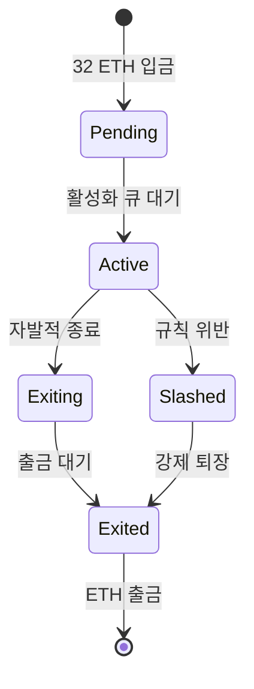
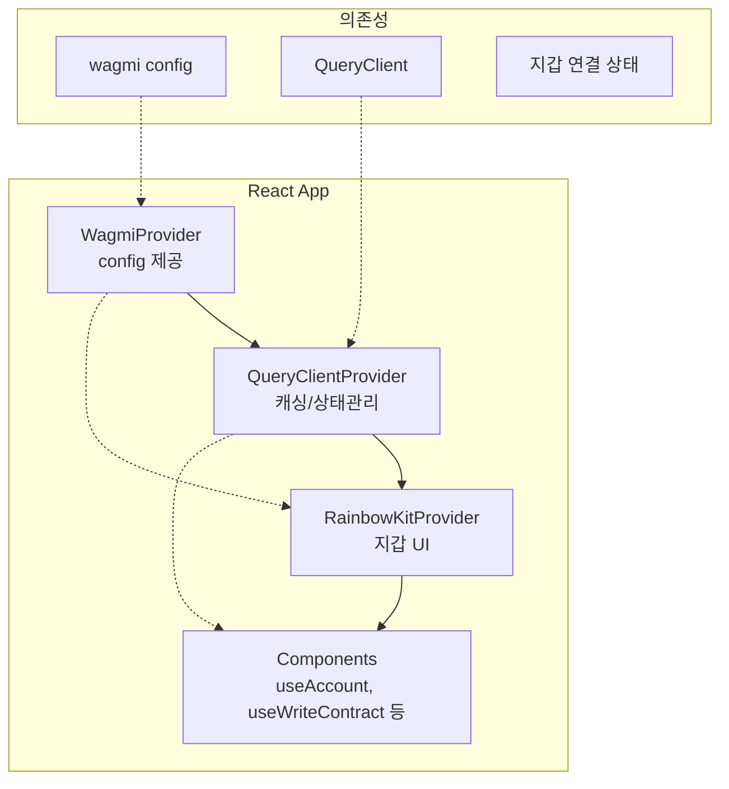

# Week 5 Quiz: PoS/Consensus + RainbowKit

> **제출 방법:** 이 파일을 복사하여 답변을 작성한 후, PR로 제출하세요.
> **평가 기준:** 개념 이해도 중심 - 문법 오류보다 논리적 설명을 중시합니다.

---

## 문제 1: PoS 개념 (객관식)

이더리움이 PoW(작업 증명)에서 PoS(지분 증명)로 전환한 **가장 주요한 이유**는 무엇인가요?

**보기:**
A) 트랜잭션 처리 속도를 10배 이상 높이기 위해
B) 에너지 소비를 99.95% 이상 줄이고 환경 친화적으로 만들기 위해
C) 블록 크기를 늘려서 더 많은 데이터를 저장하기 위해
D) 채굴 장비 없이도 누구나 블록을 생성할 수 있게 하기 위해

**답변:**
<!--
정답 알파벳과 왜 이 답을 선택했는지 설명하세요.
PoW의 문제점과 PoS의 해결책을 연결지어 설명하면 더 좋습니다.
-->
B
PoW의 가장 큰 문제 중 하나는 블록 생성 과정에서 막대한 연산이 필요하다는 점이고, 그만큼 전력 소비가 매우 크다는 것이다.
이더리움이 PoS로 전환한 가장 주요한 이유는 이런 에너지 낭비를 크게 줄이면서도 보안을 유지하기 위해서이다.
---

## 문제 2: 검증자 역할 (객관식)

이더리움 PoS에서 검증자(Validator)가 수행하는 **두 가지 주요 역할**은 무엇인가요?

**보기:**
A) 블록 채굴(Mining)과 가스 가격 결정
B) 블록 제안(Proposing)과 블록 증명(Attesting)
C) 트랜잭션 전송과 수수료 수집
D) 스마트 컨트랙트 배포와 실행

**답변:**
<!--
정답 알파벳과 각 역할이 무엇을 의미하는지 설명하세요.
-->
B
이더리움 PoS에서 검증자의 두 가지 핵심 역할은 블록 제안과 블록 증명이다.
블록 제안은 선택된 검증자가 새로운 블록을 만들어 네트워크에 제시하는 역할이고, 블록 증명은 다른 검증자들이 그 블록이 올바른지 확인하고 투표를 보내는 역할이다.

즉 한 검증자는 어떤 슬롯에서는 직접 블록을 제안할 수 있고, 대부분의 경우에는 다른 검증자가 제안한 블록을 검토하고 합의에 참여한다.
---

## 문제 3: 왜 PoW에서 PoS로? (단답형)

PoW(작업 증명)와 PoS(지분 증명)의 **핵심 차이점**은 무엇인가요?
"자격 증명 방식"과 "보안 보장 방식" 두 관점에서 각각 비교하세요.

**답변:**
<!--
자격 증명 방식:
- PoW:
- PoS:

보안 보장 방식:
- PoW:
- PoS:
-->
자격 증명 방식:
- PoW: 블록 생성 자격은 많은 연산을 수행해 정답이 되는 nonce를 가장 먼저 찾는 능력에서 나온다.
즉, 실제 계산 자원과 전기 사용을 통해 참여 자격을 증명한다.
- PoS: 블록 생성 자격은 네트워크에 일정량의 자산을 스테이킹한 검증자에게 주어진다.
즉, 연산 능력보다 얼마나 자신의 자산을 걸고 검증자로 참여하느냐가 자격의 기준이 된다.

보안 보장 방식:
- PoW: 공격자가 체인을 조작하려면 네트워크 전체의 매우 큰 해시 파워를 확보해야 하므로 공격 비용이 막대하다. 따라서 물리적인 자원 소모가 보안을 보장한다.
- PoS: 공격자가 체인을 조작하려면 많은 지분을 확보해야 하고 잘못된 행동을 하면 스테이킹한 자산이 슬래싱될 수 있다. 따라서 경제적 손실 위험과 담보 자산이 보안을 보장한다.

---

## 문제 4: 슬래싱의 목적 (단답형)

슬래싱(Slashing)은 검증자의 스테이킹된 ETH를 **강제로 소각**하는 패널티입니다.

1) 슬래싱이 발동되는 **두 가지 조건**은 무엇인가요?
2) **왜** 이런 처벌이 필요한가요? 없다면 어떤 문제가 생길 수 있나요?

**답변:**
<!--
1) 슬래싱 조건 (2가지):
   -
   -

2) 슬래싱이 필요한 이유:

-->
1) 슬래싱 조건 (2가지):
   - 같은 슬롯에 대해 서로 다른 두 블록을 제안하는 경우
   - 서로 충돌하는 증명에 서명하는 경우 : 
    1. 같은 타켓 epoch에 대해 서로 다른 증명을 두 번 하는 경우 (Double Vote)
    2. 한 증명이 다른 증명의 source checkpoint와 target checkpoint 구간을 감싸는 경우 (Surround Vote)

2) 슬래싱이 필요한 이유:
슬래싱은 검증자가 아무 비용 없이 서로 모순되는 블록이나 투표를 여러 개 내는 행동을 못 하게 막기 위해 필요하다. PoS에서는 PoW처럼 전기를 소모하는 비용이 없다.
따라서 이런 강한 경제적 처벌이 없으면 검증자가 여러 체인에 동시에 서명하거나 충돌하는 투표를 남발해도 손해가 적어 합의 안전성이 크게 약해질 수 있다.
---

## 문제 5: 체인 선택 규칙 (단답형)

여러 유효한 블록이 동시에 제안되면 **포크(Fork)**가 발생합니다.
이더리움의 LMD-GHOST(Latest Message Driven GHOST) 규칙은 어떻게 "정규 체인"을 선택하나요?

1) LMD-GHOST의 기본 원리는 무엇인가요?
2) **왜** "가장 최근 메시지"를 사용하나요? (오래된 메시지를 사용하면 어떤 문제가?)

**답변:**
<!--
1) LMD-GHOST 원리:


2) 최근 메시지 사용 이유:

-->
1) LMD-GHOST 원리:
LMD-GHOST는 포크가 발생했을 때 단순히 가장 긴 체인을 고르는 것이 아니라 각 검증자의 가장 최근 증명 메시지(attestation - 증언)가 어느 블록을 지지하는지를 기준으로 정규 체인을 선택하는 규칙이다.
구체적으로는 제네시스부터 시작해서 현재 블록의 자식들 중 가장 많은 최신 지지를 받은 자식을 선택하고 그 자식으로 한 단계 내려가며 같은 과정을 반복한다.
이렇게 계속 내려가다 보면 최종적으로 가장 많은 최신 지지를 받고 있는 경로가 정규 체인으로 선택된다.

2) 최근 메시지 사용 이유:
검증자는 시간이 지나면서 더 새로운 블록과 더 많은 정보를 보게 되므로, 예전에 보낸 증언보다 최근 증언이 현재 검증자의 실제 판단을 더 잘 반영한다. 따라서 포크 선택에서는 각 검증자의 가장 최신 의사 표현만 반영해야 지금 네트워크가 어느 체인을 더 지지하는지 정확히 알 수 있다.

예시 :
           G
           |
           A
         /   \
        B     C
      /   \     \
     D     E     H
     |            |
     F            I

검증자가 5명 있음

V1의 최신 attestation → F 지지
V2의 최신 attestation → F 지지
V3의 최신 attestation → E 지지
V4의 최신 attestation → I 지지
V5의 최신 attestation → I 지지

최신의 투표는 리프에 하지만 그 표는 결국 그 조상 블록 전체를 지지하게 됨

예를 들어 F를 지지하면 F,D,B,A,G를 모두 지지하는 것임
마찬가지로 E를 지지하면 E,B,A,G를 지지하게 됨

이때 F를 지지하는 것이 2표고 E를 지지하는 것이 1표이니 B는 3표가 되고,
C는 I를 지지하는 표인 2표가 됨

따라서 G -> B vs C = 3 vs 2 = B가 이김 -> D vs E = 2 vs 1 = D가 이김 -> F
가 됨

큰 그림으로는 표가 누적되는 느낌:

           G(5)
           |
           A(5)
         /     \
      B(3)     C(2)
     /   \        \
  D(2)   E(1)     H(2)
   |                 |
  F(2)              I(2)

---

## 문제 6: RainbowKit Provider 계층 (빈칸 채우기)

다음 코드의 빈칸을 채워서 RainbowKit을 올바르게 설정하세요.
**Provider 순서가 중요합니다!**

```typescript
'use client';

// TODO: 필요한 스타일 import
_________________________________________

import { RainbowKitProvider } from '@rainbow-me/rainbowkit';
import { WagmiProvider } from 'wagmi';
import { QueryClientProvider, QueryClient } from '@tanstack/react-query';
import { config } from '@/config/wagmi';

const queryClient = new QueryClient();

export default function RootLayout({ children }) {
  return (
    <html lang="ko">
      <body>
        {/* TODO: Provider를 올바른 순서로 중첩하세요 */}
        <_________________ config={config}>
          <_________________ client={queryClient}>
            <_________________>
              {children}
            </_________________>
          </_________________>
        </_________________>
      </body>
    </html>
  );
}
```

**답변:**
```typescript
// 완성된 코드를 여기에 작성하세요

```

**왜 이 순서인가요:**
<!--
Provider 순서가 왜 중요한지 설명하세요.
순서가 잘못되면 어떤 오류가 발생하나요?
-->


---

## 문제 7: Provider 순서 버그 (취약점 찾기)

다음 코드에서 **문제점**을 찾고 수정하세요:

```typescript
// BAD CODE - 문제점 찾기
'use client';

import '@rainbow-me/rainbowkit/styles.css';
import { RainbowKitProvider } from '@rainbow-me/rainbowkit';
import { WagmiProvider } from 'wagmi';
import { QueryClientProvider, QueryClient } from '@tanstack/react-query';
import { config } from '@/config/wagmi';

const queryClient = new QueryClient();

export default function Providers({ children }) {
  return (
    // 문제가 있는 Provider 순서!
    <QueryClientProvider client={queryClient}>
      <RainbowKitProvider>
        <WagmiProvider config={config}>
          {children}
        </WagmiProvider>
      </RainbowKitProvider>
    </QueryClientProvider>
  );
}
```

**1) 발견한 문제점:**
<!--
무엇이 잘못되었는지 설명하세요.
-->
RainbowKitProvider가 WagmiProvider보다 바깥에 배치되어 있다.
즉 RainbowKit이 내부적으로 필요로 하는 wagmi context가 아직 제공되지 않은 상태에서 먼저 렌더링되고 있다.

**2) 왜 이것이 문제인가:**
<!--
이 순서로 인해 어떤 오류가 발생하는지 설명하세요.
-->
RainbowKit은 지갑 연결 상태, 계정 정보, 체인 정보 등을 wagmi에 의존해서 동작한다.
그런데 현재 코드에서는 RainbowKitProvider가 WagmiProvider보다 먼저 렌더링되므로, RainbowKit 내부 컴포넌트가 wagmi를 찾지 못해 오류가 발생할 수 있다.

**3) 올바른 수정 방법:**
```typescript
// GOOD CODE - 수정된 버전을 작성하세요
'use client';

import '@rainbow-me/rainbowkit/styles.css';
import { RainbowKitProvider } from '@rainbow-me/rainbowkit';
import { WagmiProvider } from 'wagmi';
import { QueryClientProvider, QueryClient } from '@tanstack/react-query';
import { config } from '@/config/wagmi';

const queryClient = new QueryClient();

export default function Providers({ children }) {
  return (
    <WagmiProvider config={config}>
      <QueryClientProvider client={queryClient}>
        <RainbowKitProvider>
          {children}
        </RainbowKitProvider>
      </QueryClientProvider>
    </WagmiProvider>
  );
}
```

---

## 문제 8: 트랜잭션 상태 처리 (빈칸 채우기)

다음 코드의 빈칸을 채워서 트랜잭션 전송 후 **확인 상태를 추적**하세요:

```typescript
'use client';

import { useWriteContract, _________________ } from 'wagmi';

const abi = [
  {
    name: 'increment',
    type: 'function',
    stateMutability: 'nonpayable',
    inputs: [],
    outputs: [],
  },
] as const;

function IncrementButton() {
  const { writeContract, data: hash, isPending } = useWriteContract();

  // TODO: 트랜잭션 확인 상태를 추적하는 hook
  const { isLoading: isConfirming, isSuccess } = _________________({
    _________________,
  });

  return (
    <div>
      <button
        onClick={() =>
          writeContract({
            address: '0x1234...5678',
            abi,
            functionName: 'increment',
          })
        }
        disabled={isPending || isConfirming}
      >
        {isPending ? '서명 대기 중...' : isConfirming ? '확인 중...' : '증가'}
      </button>

      {isSuccess && <p>트랜잭션 성공!</p>}
    </div>
  );
}
```

**답변:**
```typescript
// 완성된 코드를 여기에 작성하세요
'use client';

import { useWriteContract, useWaitForTransactionReceipt } from 'wagmi';

const abi = [
  {
    name: 'increment',
    type: 'function',
    stateMutability: 'nonpayable',
    inputs: [],
    outputs: [],
  },
] as const;

function IncrementButton() {
  const { writeContract, data: hash, isPending } = useWriteContract();

  const { isLoading: isConfirming, isSuccess } = useWaitForTransactionReceipt({
    hash,
  });

  return (
    <div>
      <button
        onClick={() => {
          writeContract({
            address: '0x1234567890123456789012345678901234567890',
            abi,
            functionName: 'increment',
          });
        }}
        disabled={isPending || isConfirming}
      >
        {isPending ? '서명 대기 중...' : isConfirming ? '확인 중...' : '증가'}
      </button>

      {isSuccess && <p>트랜잭션 성공!</p>}
    </div>
  );
}
```

**트랜잭션 상태 흐름을 설명하세요:**
<!--
1) isPending 상태:
2) isConfirming 상태:
3) isSuccess 상태:
-->
1) isPending 상태:
사용자가 버튼을 눌러 트랜잭션을 보내려고 했지만, 아직 지갑 서명 또는 전송이 끝나지 않은 상태이다. 즉 사용자가 지갑에서 승인하는 중인 단계이다.
2) isConfirming 상태:
트랜잭션은 이미 전송되어 해시가 생성되었고, 그것이 실제 블록에 포함되어 확인되기를 기다리는 상태이다. 즉 서명은 끝났지만 아직 온체인에 확정이 되기 전 상태이다.
3) isSuccess 상태:
트랜잭션이 성공적으로 블록에 포함되어 receipt 확인까지 끝난 상태이다. 따라서 이 시점에는 화면에 성공 메시지를 보여주면 된다.
---

## 문제 9: 검증자 생애주기 (다이어그램 해석)

다음 다이어그램은 이더리움 검증자의 생애주기를 보여줍니다:



**질문:**

1) **Active** 상태에서 검증자가 수행하는 주요 활동은 무엇인가요?

Active 상태의 검증자는 실제 합의에 참여하는 상태이다. 이때 검증자는 슬롯에 따라 블록을 제안하거나, 다른 검증자가 제안한 블록에 대해 증언을 보내며 어느 체인이 정규 체인인지 결정하는 데 참여한다.

2) Active에서 **Slashed**로 전이되는 조건은 무엇인가요? 이 경우 검증자에게 어떤 일이 발생하나요?
검증자가 합의 규칙을 어기는 경우 Active에서 Slashed로 전이된다. 대표적으로 같은 슬롯에 서로 다른 두 블록을 제안하는 경우나, 서로 충돌하는 증언에 서명하는 경우가 있다.
이 경우 검증자는 단순히 비활성화되는 것이 아니라 스테이킹된 ETH의 일부를 잃는 패널티를 받는다.

3) 검증자가 자발적으로 종료(**Exiting**)하려면 왜 바로 ETH를 출금할 수 없고 대기 기간이 필요한가요?
검증자가 종료를 신청하자마자 바로 ETH를 출금할 수 있다면 규칙 위반이나 악의적 행동을 한 뒤 곧바로 자금을 빼서 책임을 피하려는 문제가 생길 수 있다.
그래서 일정한 대기 기간을 두어 그 검증자가 과거에 잘못된 행동을 했는지 확인하고 필요한 경우 패널티를 적용할 수 있게 한다.
---

## 문제 10: Provider 계층 구조 (다이어그램 해석)

다음 다이어그램은 RainbowKit/wagmi 앱의 Provider 구조를 보여줍니다:



**질문:**

1) **WagmiProvider**가 가장 바깥에 있어야 하는 이유는 무엇인가요?

WagmiProvider는 지갑 연결 정보, 현재 계정, 네트워크, 컨트랙트 호출 같은 wagmi의 핵심 기능을 제공하는 역할을 한다. 
RainbowKitProvider는 이 wagmi를 기반으로 동작하므로 먼저 바깥에서 WagmiProvider가 감싸고 있어야 한다.

2) **QueryClientProvider**의 역할은 무엇인가요? 없다면 어떤 문제가 발생하나요?

QueryClientProvider는 비동기 데이터의 캐싱, 재요청, 로딩 상태, 에러 상태 관리를 가능하게 한다.
wagmi의 여러 hook들도 내부적으로 이런 query 시스템을 활용하므로 QueryClientProvider가 있어야 읽기 요청이나 트랜잭션 상태 추적이 안정적으로 동작한다.

3) 아래 코드에서 `useAccount()` hook이 **"Cannot find WagmiContext"** 오류를 발생시키는 이유는 무엇인가요?

```typescript
// 오류 발생 코드
<QueryClientProvider>
  <RainbowKitProvider>
    <WagmiProvider>  {/* WagmiProvider가 안쪽에 있음 */}
      <MyComponent />  {/* useAccount() 호출 */}
    </WagmiProvider>
  </RainbowKitProvider>
</QueryClientProvider>
```
useAccount()는 wagmi context 안에서만 동작하는 hook인데 현재 코드에서는 provider 순서가 잘못되어 있다.
즉 wagmi context를 먼저 제공해야 하는데 순서가 뒤집혀 있어서, useAccount()가 자신이 참조해야 할 WagmiContext를 찾지 못하고 오류가 발생하는 것이다.
---

## 제출 전 체크리스트

- [V] 모든 문제에 답변을 작성했는가?
- [V] 객관식 문제: 정답 선택 **이유**를 설명했는가?
- [V] 단답형 문제: 2-3문장 이상으로 충분히 설명했는가?
- [V] 코드 문제: 완성된 코드와 **왜 그렇게 작성했는지** 설명했는가?
- [V] 다이어그램 문제: 각 질문에 논리적으로 답변했는가?
