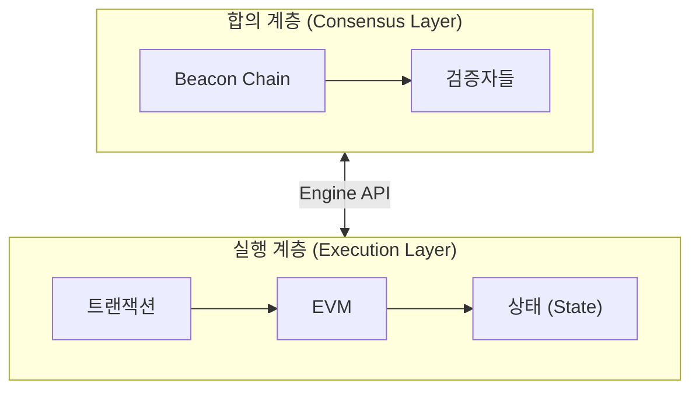
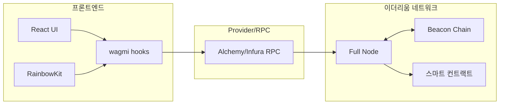

# Week 6 Quiz: Beacon Chain/Finality + Final Project Integration

> **제출 방법:** 이 파일을 복사하여 답변을 작성한 후, PR로 제출하세요.
> **평가 기준:** 개념 이해도 중심 - 6주간 배운 내용을 **통합**하여 설명하세요.

---

## 문제 1: Beacon Chain 역할 (객관식)

Beacon Chain의 **주요 역할**은 무엇인가요?

**보기:**
A) 스마트 컨트랙트를 실행하고 상태를 관리한다
B) 검증자를 관리하고 합의를 조정하며 블록 최종성을 결정한다
C) 트랜잭션 수수료를 계산하고 분배한다
D) 사용자의 지갑을 생성하고 개인키를 관리한다

**답변:**
<!--
정답 알파벳과 Beacon Chain이 "합의 계층(Consensus Layer)"으로서 하는 역할을 설명하세요.
실행 계층(Execution Layer)과의 차이도 언급하면 더 좋습니다.
-->
B
Beacon Chain의 주요 역할은 검증자를 관리하고, PoS 합의를 조정하며, 어떤 블록이 정식으로 인정되고 finality를 얻는지 결정하는 것이다.
즉 Beacon Chain은 이더리움의 합의 계층으로서, 누가 블록을 제안할지, 누가 attest할지, 어떤 체인을 정규 체인으로 볼지 등을 관리한다.

반면 실행 계층은 사용자의 트랜잭션을 실제로 처리하고, 스마트 컨트랙트를 실행하며, 계정 잔액과 상태를 갱신하는 역할을 맡는다.
---

## 문제 2: Finality 개념 (객관식)

이더리움에서 **Finality(최종성)**가 달성되면 어떤 상태인가요?

**보기:**
A) 트랜잭션이 mempool에 들어간 상태
B) 블록이 체인에 추가되었지만 아직 재조직(reorg)될 수 있는 상태
C) 전체 검증자의 1/3 이상이 슬래싱되지 않는 한 절대 변경되지 않는 상태
D) 24시간이 지나서 트랜잭션이 만료된 상태

**답변:**
<!--
정답 알파벳과 왜 "1/3 이상 슬래싱"이 조건인지 설명하세요.
Finality가 왜 중요한지도 언급하세요.
-->
C
Finality가 달성되었다는 것은 그 블록과 그 이전 체인이 사실상 되돌릴 수 없을 정도로 확정되었다는 뜻이다.
이더리움 PoS에서는 이를 깨려면 단순히 더 긴 체인을 만드는 것으로는 부족하고, 전체 검증자 중 최소 1/3 이상이 잘못된 행동에 가담해 슬래싱될 정도의 충돌이 필요하다.
finality는 그래서 큰 자산 이동이나 브리지, 거래소 입금 확정 같은 데서 매우 중요하다.

왜 1/3이 기준이냐면, Casper FFG의 안전성은 검증자 집합의 상당수가 정직하다는 가정 위에 서 있고, 서로 충돌하는 두 개의 finalized checkpoint를 만들려면 적어도 1/3 이상의 검증자가 모순되는 attestations에 관여해야 하기 때문이다.
---

## 문제 3: 왜 Finality가 중요한가 (단답형)

거래소나 dApp 개발자에게 **Finality**가 왜 중요한가요?
다음 시나리오를 예로 들어 설명하세요:

> 사용자가 거래소에 100 ETH를 입금하고, 거래소가 확인 후 내부 잔액에 반영했습니다.
> 그런데 나중에 블록 재조직(reorg)이 발생하여 입금 트랜잭션이 사라졌습니다.

**답변:**
<!--
1) 위 시나리오에서 거래소에 어떤 문제가 발생하나요?

2) Finality가 있으면 이 문제가 어떻게 해결되나요?

3) 이더리움에서 Finality까지 얼마나 기다려야 하나요?
-->
1) 위 시나리오에서 거래소에 어떤 문제가 발생하나요?
거래소가 입금 트랜잭션을 확정된 것으로 너무 일찍 믿고 사용자 계정에 100 ETH를 반영했는데, 나중에 reorg로 그 입금이 사라지면 거래소는 실제로는 받지 못한 자산을 이미 사용자에게 지급한 셈이 된다. 
그러면 사용자는 그 잔액으로 매매를 하거나 출금할 수 있고, 결과적으로 거래소가 손실을 떠안을 수 있다.
블록이 단순히 체인에 포함되었다는 것과, 나중에 뒤집히지 않을 정도로 확정되었다는 것은 다르기 때문에 이런 문제가 생긴다.

2) Finality가 있으면 이 문제가 어떻게 해결되나요?
Finality가 적용된 뒤에만 입금을 확정 처리하면, 그 트랜잭션은 상당한 규모의 검증자 위반과 슬래싱 없이는 뒤집을 수 없는 상태가 된다.
즉 거래소 입장에서는 강한 안전성을 얻는 것이고 그래서 큰 금액 입금, 브리지, 거래소 정산 같은 곳에서 finality가 매우 중요하다.

3) 이더리움에서 Finality까지 얼마나 기다려야 하나요?
이더리움에서는 슬롯이 12초이고, 1 epoch는 32 slots라서 6.4분이다. 일반적으로 checkpoint finality는 약 2 epochs, 즉 약 12.8분 정도면 달성된다.
그래서 실무적으로는 네트워크가 정상적일 때 대략 13분 안팎을 finality 기준으로 보는 경우가 많다.

---

## 문제 4: 포크 선택 규칙 (단답형)

이더리움은 **Casper FFG**와 **LMD-GHOST** 두 가지 메커니즘을 결합합니다.
각각의 역할은 무엇이며, **왜** 둘 다 필요한가요?

**답변:**
<!--
1) Casper FFG의 역할:

2) LMD-GHOST의 역할:

3) 왜 둘 다 필요한가 (한쪽만 있으면 어떤 문제?):
-->
1) Casper FFG의 역할:
Casper FFG는 이더리움에서 checkpoint를 justify/finalize해서 블록이 최종적으로 확정되도록 하는 장치이다.
즉 어떤 블록이 단순히 지금 더 많은 지지를 받고 있는 수준을 넘어서, 나중에 쉽게 뒤집히지 않는 상태가 되게 만든다.
그래서 Casper FFG는 이더리움의 finality와 안전성을 담당한다고 볼 수 있다.

2) LMD-GHOST의 역할:
LMD-GHOST는 포크가 여러 개 생겼을 때 지금 이 순간 어떤 체인을 head로 선택할지 정하는 규칙이다.
각 검증자의 가장 최근 attestation만 반영해서, 가장 많은 최신 지지를 받고 있는 경로를 따라 내려가며 정규 체인을 고른다.
즉 LMD-GHOST는 빠르게 변하는 포크 상황에서 실시간 head 선택을 담당한다.

3) 왜 둘 다 필요한가 (한쪽만 있으면 어떤 문제?):
LMD-GHOST만 있으면 현재 어느 체인을 따라가야 하는지는 정할 수 있지만, 그 체인이 언제 완전히 확정되었는지는 보장하지 못한다.
반대로 Casper FFG만 있으면 최종성은 줄 수 있지만, 매 슬롯마다 여러 포크 중 당장 어느 블록을 head로 삼아야 하는지를 세밀하게 고르기 어렵다.

즉 LMD-GHOST는 “지금 어디를 따라갈까”를 정하고, Casper FFG는 “어디까지는 이제 확정이다”를 정한다.
---

## 문제 5: dApp 아키텍처 설계 (코드/아키텍처 문제)

당신은 "간단한 투표 dApp"을 만들려고 합니다.
다음 요구사항을 읽고 **컴포넌트 구조**와 **사용할 hook**들을 설계하세요.

**요구사항:**
- 사용자가 지갑을 연결할 수 있다
- 현재 투표 현황(찬성/반대 수)을 조회할 수 있다
- 사용자가 찬성 또는 반대 투표를 할 수 있다
- 투표 후 결과가 화면에 즉시 반영된다

**답변:**

```
1) 컴포넌트 구조 (어떤 컴포넌트가 필요한가):
- ConnectWallet
- VoteStatus
- VoteButtons


2) 각 컴포넌트에서 사용할 wagmi/RainbowKit hook:
   - 지갑 연결:
     ConnectButton(RainbowKit), useAccount
   - 투표 현황 조회:
     useReadContract
   - 투표 실행:
     useWriteContract
   - 트랜잭션 확인:
     useWaitForTransactionReceipt

3) Provider 계층 구조:
<WagmiProvider config={config}>
  <QueryClientProvider client={queryClient}>
    <RainbowKitProvider>
      <App />
    </RainbowKitProvider>
  </QueryClientProvider>
</WagmiProvider>
```

**왜 이렇게 설계했나요:**
<!--
각 hook의 선택 이유와 데이터 흐름을 설명하세요.
-->
지갑 연결은 RainbowKit의 ConnectButton을 쓰면 UI를 직접 만들지 않아도 되고, useAccount로 현재 연결 여부와 주소를 쉽게 확인할 수 있다.

투표 현황은 컨트랙트의 yesCount, noCount 같은 읽기 함수가 있을 것이므로 useReadContract로 조회하는 것이 가장 자연스럽다.

사용자가 찬성/반대 버튼을 누를 때는 상태를 바꾸는 write 호출이 필요하므로 useWriteContract를 쓴다.
그리고 write는 지갑 서명만 끝났다고 끝이 아니라 실제 블록에 포함되어야 하므로, 전송 후 받은 tx hash를 useWaitForTransactionReceipt에 넣어서 확인 상태를 추적하는 것이 좋다.

투표 후 결과가 화면에 즉시 반영되어야 하므로, 트랜잭션이 성공한 뒤 VoteStatus가 다시 읽히도록 해야 한다.
즉 데이터 흐름은 지갑 연결 → 현재 결과 조회 → 투표 실행 → tx confirm → 결과 재조회 순서로 가는 구조가 가장 깔끔하다.

---

## 문제 6: 컨트랙트-프론트엔드 연동 (빈칸 채우기)

다음 코드의 빈칸을 채워서 투표 컨트랙트와 프론트엔드를 연동하세요:

**Solidity 컨트랙트:**
```solidity
contract Voting {
    uint256 public yesVotes;
    uint256 public noVotes;

    function voteYes() external {
        yesVotes += 1;
    }

    function voteNo() external {
        noVotes += 1;
    }
}
```

**React 컴포넌트:**
```typescript
import { useReadContract, useWriteContract, _________________ } from 'wagmi';

const votingABI = [
  { name: 'yesVotes', type: 'function', stateMutability: 'view', inputs: [], outputs: [{ type: 'uint256' }] },
  { name: 'noVotes', type: 'function', stateMutability: 'view', inputs: [], outputs: [{ type: 'uint256' }] },
  { name: 'voteYes', type: 'function', stateMutability: 'nonpayable', inputs: [], outputs: [] },
  { name: 'voteNo', type: 'function', stateMutability: 'nonpayable', inputs: [], outputs: [] },
] as const;

function VotingApp() {
  // 찬성 투표 수 조회
  const { data: yesCount, refetch: refetchYes } = useReadContract({
    address: '0x1234...5678',
    abi: votingABI,
    functionName: '_________________',
  });

  // 반대 투표 수 조회
  const { data: noCount, refetch: refetchNo } = useReadContract({
    address: '0x1234...5678',
    abi: votingABI,
    functionName: '_________________',
  });

  // 투표 실행
  const { writeContract, data: hash, isPending } = useWriteContract();

  // 트랜잭션 확인 대기
  const { isLoading: isConfirming, isSuccess } = _________________({
    hash,
  });

  // 트랜잭션 성공 시 데이터 새로고침
  // TODO: isSuccess가 true가 되면 refetch를 호출해야 함

  const handleVoteYes = () => {
    writeContract({
      address: '0x1234...5678',
      abi: votingABI,
      functionName: '_________________',
    });
  };

  return (
    <div>
      <h2>현재 투표 현황</h2>
      <p>찬성: {_________________}</p>
      <p>반대: {noCount?.toString()}</p>

      <button onClick={handleVoteYes} disabled={isPending || isConfirming}>
        {isPending ? '서명 중...' : isConfirming ? '확인 중...' : '찬성 투표'}
      </button>

      {isSuccess && <p>투표 완료!</p>}
    </div>
  );
}
```

**답변:**
```typescript
// 완성된 코드를 여기에 작성하세요
import { useReadContract, useWriteContract, useWaitForTransactionReceipt } from 'wagmi';

const votingABI = [
  { name: 'yesVotes', type: 'function', stateMutability: 'view', inputs: [], outputs: [{ type: 'uint256' }] },
  { name: 'noVotes', type: 'function', stateMutability: 'view', inputs: [], outputs: [{ type: 'uint256' }] },
  { name: 'voteYes', type: 'function', stateMutability: 'nonpayable', inputs: [], outputs: [] },
  { name: 'voteNo', type: 'function', stateMutability: 'nonpayable', inputs: [], outputs: [] },
] as const;

function VotingApp() {
  // 찬성 투표 수 조회
  const { data: yesCount, refetch: refetchYes } = useReadContract({
    address: '0x1234...5678',
    abi: votingABI,
    functionName: 'yesVotes',
  });

  // 반대 투표 수 조회
  const { data: noCount, refetch: refetchNo } = useReadContract({
    address: '0x1234...5678',
    abi: votingABI,
    functionName: 'noVotes',
  });

  // 투표 실행
  const { writeContract, data: hash, isPending } = useWriteContract();

  // 트랜잭션 확인 대기
  const { isLoading: isConfirming, isSuccess } = useWaitForTransactionReceipt({
    hash,
  });

  // 트랜잭션 성공 시 데이터 새로고침
  // TODO: isSuccess가 true가 되면 refetch를 호출해야 함

  const handleVoteYes = () => {
    writeContract({
      address: '0x1234...5678',
      abi: votingABI,
      functionName: 'voteYes',
    });
  };

  return (
    <div>
      <h2>현재 투표 현황</h2>
      <p>찬성: {yesCount?.toString()}</p>
      <p>반대: {noCount?.toString()}</p>

      <button onClick={handleVoteYes} disabled={isPending || isConfirming}>
        {isPending ? '서명 중...' : isConfirming ? '확인 중...' : '찬성 투표'}
      </button>

      {isSuccess && <p>투표 완료!</p>}
    </div>
  );
}

```

**데이터 흐름을 설명하세요:**
<!--
1) 사용자가 "찬성 투표" 버튼 클릭 -> ... -> 화면 업데이트까지의 과정을 설명하세요.
-->
사용자가 "찬성 투표" 버튼 클릭 -> handleVoteYes가 실행되고 writeContract가 voteYes()를 호출한다.
이때 사용자는 지갑에서 트랜잭션 서명을 하게 되고, 이 단계가 isPending 상태이다.

서명이 끝나고 트랜잭션이 전송되면 tx hash가 생성된다.
그 다음 useWaitForTransactionReceipt({ hash })가 그 해시를 기준으로 실제 블록에 포함될 때까지 기다리며, 이 단계가 isConfirming 상태이다.

트랜잭션이 성공적으로 채굴되면 isSuccess가 true가 된다.
그러면 useEffect가 동작해서 refetchYes()와 refetchNo()를 호출하고, 컨트랙트의 최신 yesVotes, noVotes 값을 다시 읽어온다.

그 결과 화면에 표시되는 yesCount, noCount가 새 값으로 갱신된다.
즉 흐름은 버튼 클릭 -> 서명 -> 전송 -> 블록 포함 확인 -> refetch -> 화면 업데이트 순서이다.

---

## 문제 7: 트랜잭션 흐름 디버깅 (취약점 찾기)

다음 코드에서 **문제점**을 찾고 수정하세요. 사용자가 투표를 해도 화면이 업데이트되지 않습니다.

```typescript
// BAD CODE - 왜 화면이 업데이트되지 않나요?
function BrokenVoting() {
  const { data: voteCount } = useReadContract({
    address: '0x...',
    abi: votingABI,
    functionName: 'yesVotes',
  });

  const { writeContract, data: hash } = useWriteContract();

  const { isSuccess } = useWaitForTransactionReceipt({ hash });

  const handleVote = () => {
    writeContract({
      address: '0x...',
      abi: votingABI,
      functionName: 'voteYes',
    });
  };

  // isSuccess가 true가 되어도 voteCount가 업데이트되지 않음!

  return (
    <div>
      <p>찬성: {voteCount?.toString()}</p>
      <button onClick={handleVote}>투표</button>
      {isSuccess && <p>투표 완료!</p>}
    </div>
  );
}
```

**1) 발견한 문제점:**
<!--
왜 화면이 업데이트되지 않는지 설명하세요.
-->
문제는 트랜잭션이 성공해서 isSuccess가 true가 되어도, useReadContract로 읽어온 voteCount를 다시 읽어오지 않는다는 점이다.

즉 온체인에서는 yesVotes 값이 바뀌었지만, 프론트엔드 쪽에서는 예전에 읽어온 값만 그대로 들고 있어서 화면이 갱신되지 않는다.

useWaitForTransactionReceipt는 트랜잭션이 성공했는지 알려줄 뿐이고, 자동으로 useReadContract의 값을 다시 가져와 주지는 않는다.

그래서 트랜잭션 성공 이후에 refetch()를 직접 호출하거나, query invalidation 같은 방식으로 다시 읽게 만들어야 한다.

**2) 올바른 수정 방법:**
```typescript
// GOOD CODE - 수정된 버전을 작성하세요
function FixedVoting() {
  const { data: voteCount, refetch } = useReadContract({
    address: '0x...',
    abi: votingABI,
    functionName: 'yesVotes',
  });

  const { writeContract, data: hash, isPending } = useWriteContract();

  const { isLoading: isConfirming, isSuccess } = useWaitForTransactionReceipt({
    hash,
  });

  const handleVote = () => {
    writeContract({
      address: '0x...',
      abi: votingABI,
      functionName: 'voteYes',
    });
  };

  useEffect(() => {
    if (isSuccess) {
      refetch();
    }
  }, [isSuccess, refetch]);

  return (
    <div>
      <p>찬성: {voteCount?.toString()}</p>
      <button onClick={handleVote} disabled={isPending || isConfirming}>
        {isPending ? '서명 중...' : isConfirming ? '확인 중...' : '투표'}
      </button>
      {isSuccess && <p>투표 완료!</p>}
    </div>
  );
}


```

**3) refetch가 필요한 이유:**
<!--
블록체인 데이터와 React 상태의 관계를 설명하세요.
-->
블록체인 데이터는 컨트랙트 안에 저장되어 있고, React 컴포넌트는 그 값을 한 번 읽어와서 화면에 보여주는 역할만 한다.
따라서 컨트랙트 상태가 바뀌었다고 해서 React가 그 사실을 자동으로 아는 것은 아니다.

즉 voteYes()가 실행되어 온체인 값이 증가해도, 프론트엔드는 다시 조회하기 전까지는 이전 값을 계속 보여준다.
그래서 트랜잭션이 성공한 뒤 refetch()를 호출해서 최신 온체인 데이터를 다시 읽어와야 화면이 업데이트된다.

---

## 문제 8: Beacon Chain 구조 (다이어그램 해석)

다음 다이어그램은 이더리움의 두 계층 구조를 보여줍니다:



**질문:**

1) **합의 계층(CL)**과 **실행 계층(EL)**의 역할 차이는 무엇인가요?

합의 계층은 누가 블록을 제안하고 어떤 블록이 정식 체인으로 인정될지 결정하는 층이다.
즉 검증자 관리, attestation, fork choice, finality 같은 합의 자체를 담당한다.

반면 실행 계층은 사용자 트랜잭션을 실제로 실행하는 층이다.
여기서 EVM이 스마트 컨트랙트를 실행하고, 계정 잔액이나 컨트랙트 저장값 같은 state를 실제로 바꾼다.
즉 CL은 “어떤 블록이 맞는가”를 정하고, EL은 “그 블록 안의 내용이 실제로 무엇을 수행하는가”를 처리한다.

2) **Engine API**를 통해 두 계층이 주고받는 정보는 무엇인가요?

Engine API는 합의 계층과 실행 계층이 서로 협력하기 위한 인터페이스이다.
합의 계층은 실행 계층에게 이 payload를 실행해보라, 또는 이 블록이 head 후보가 될 수 있는지 같은 요청을 보낸다.
반대로 실행 계층은 합의 계층에게 실행된 block payload, execution 결과, 유효성 검증 결과 등을 돌려준다.

즉 CL은 EL에게 블록 후보의 실행과 검증을 맡기고, EL은 그 결과를 바탕으로 CL이 합의를 계속 진행할 수 있게 정보를 제공한다.
한쪽은 합의를 하고, 다른 한쪽은 계산과 상태 전이를 담당하므로 Engine API가 둘 사이의 연결 고리 역할을 한다.

3) 사용자가 트랜잭션을 전송하면 CL과 EL에서 각각 어떤 일이 일어나나요?

사용자가 트랜잭션을 보내면 먼저 실행 계층 쪽에서 그 트랜잭션이 mempool에 들어가고, 나중에 어떤 블록에 포함될 후보가 된다.
그 블록 안에서 EVM이 트랜잭션을 실행하고, 성공하면 잔액이나 컨트랙트 state가 바뀌게 된다.

그와 동시에 합의 계층에서는 어떤 검증자가 그 슬롯의 블록 제안자인지 정해지고, 그 제안자가 execution payload를 포함한 블록을 제안한다.
다른 검증자들은 그 블록에 대해 attestation을 보내고, LMD-GHOST로 head가 정해지며, 시간이 지나면 Casper FFG를 통해 finality까지 얻게 된다.

즉 사용자 입장에서는 트랜잭션 전송 한 번이지만, 내부적으로는 EL이 실행하고 state를 바꾸고, CL이 그 결과가 담긴 블록을 합의로 확정하는 구조로 돌아간다.

---

## 문제 9: Slot/Epoch 관계 (다이어그램 해석)

다음 다이어그램은 Slot과 Epoch의 관계를 보여줍니다:

```mermaid
gantt
    title Epoch 구조 (6.4분)
    dateFormat X
    axisFormat %s

    section Epoch N
    Slot 0     :a1, 0, 12
    Slot 1     :a2, 12, 24
    Slot 2     :a3, 24, 36
    ...        :a4, 36, 372
    Slot 31    :a5, 372, 384

    section Checkpoint
    Epoch N 끝 :milestone, 384, 0
```



**질문:**

1) 1 Slot은 몇 초이고, 1 Epoch은 몇 개의 Slot으로 구성되나요?
1 Slot은 12초이고, 1 Epoch은 32개의 Slot으로 구성된다. 그래서 1 Epoch의 길이는 32 × 12 = 384초, 즉 6.4분이다.

2) **Checkpoint**는 언제 발생하며 어떤 역할을 하나요?
Checkpoint는 각 epoch마다 정해지는 기준 블록으로, 현재 이더리움에서는 각 epoch의 첫 번째 slot이 checkpoint로 사용된다.
이 checkpoint는 Casper FFG가 어떤 지점을 justify하고 finalize할지 판단하는 기준점 역할을 하며, 검증자들이 두 checkpoint 사이의 연결에 대해 충분히 attest하면 checkpoint가 justified되고, 그 다음 checkpoint까지 이어지면 finalized될 수 있다.

3) **Finality**가 달성되려면 몇 Epoch이 필요하고, 시간으로는 약 몇 분인가요?
Finality는 일반적으로 2 epochs가 지나야 달성된다. 시간으로 계산하면 2 × 6.4분 = 약 12.8분, 즉 보통 약 13분 정도라고 보면 된다.

---

## 문제 10: dApp 전체 아키텍처 (다이어그램 해석)

다음 다이어그램은 dApp의 전체 아키텍처를 보여줍니다:



**질문:**

1) 사용자가 **"투표하기" 버튼**을 클릭하면, UI에서 스마트 컨트랙트까지 데이터가 어떤 경로로 전달되나요?

사용자가 버튼을 누르면 먼저 React UI에서 클릭 이벤트가 발생하고, 그 이벤트가 wagmi의 useWriteContract 같은 hook을 호출한다.
그다음 wagmi는 지갑과 연결된 계정 정보를 바탕으로 트랜잭션 요청을 만들고, 이를 RPC Provider를 통해 이더리움 노드로 전송한다.

노드는 그 트랜잭션을 받아 네트워크에 전파하고, 이후 어떤 검증자가 제안하는 블록에 포함되면 그 안에서 스마트 컨트랙트 함수가 실행된다.
즉 큰 흐름은 UI → wagmi hooks → RPC Provider → Full Node → 스마트 컨트랙트이다.

2) **RPC Provider**(Alchemy/Infura)의 역할은 무엇인가요? 없다면 어떤 문제가 생기나요?

RPC Provider는 프론트엔드가 이더리움 네트워크와 통신할 수 있게 해주는 중간 창구 역할을 한다.
프론트엔드는 블록체인에 직접 붙는 것이 아니라, RPC endpoint를 통해 잔액 조회, 컨트랙트 읽기, 트랜잭션 전송 같은 요청을 보낸다.

만약 RPC Provider가 없다면 프론트엔드는 네트워크 상태를 읽을 수도 없고, 트랜잭션도 전송할 수 없다.
즉 wagmi hook이 있어도 실제로 연결할 노드가 없으므로 dApp은 사실상 동작하지 않게 된다.

3) 6주간 배운 내용을 종합하여, 트랜잭션이 **전송 -> 실행 -> 블록 포함 -> Finality**까지 거치는 전체 흐름을 설명하세요.

먼저 사용자가 dApp에서 투표 버튼을 누르면 지갑이 뜨고, 사용자가 서명하면 트랜잭션이 생성되어 네트워크로 전송된다.
이 트랜잭션은 실행 계층 쪽 노드의 mempool에 들어가고, 이후 어떤 검증자가 자신의 슬롯에서 블록을 제안할 때 그 트랜잭션을 블록 후보에 담을 수 있다.

그 다음 실행 계층에서는 EVM이 해당 트랜잭션을 실행한다.
예를 들어 voteYes()라면 컨트랙트의 yesVotes 값이 증가하고, 이 결과가 새로운 state로 반영된다.
즉 실행 계층은 “이 트랜잭션이 실제로 무슨 계산을 하고 state를 어떻게 바꾸는가”를 담당한다.

이후 합의 계층에서는 그 execution payload를 포함한 블록이 제안되고, 다른 검증자들이 그 블록에 대해 attestation을 보내면서 블록 포함이 이루어진다.
이 단계에서는 사용자의 트랜잭션이 이미 체인에 들어간 상태이지만, 아직 완전히 되돌릴 수 없는 상태는 아닐 수 있다.
그래서 이 시점은 “포함되었다”이지, 반드시 “완전히 확정되었다”는 뜻은 아니다.

마지막으로 시간이 지나면서 검증자들의 투표가 checkpoint들에 누적되고, Casper FFG에 의해 블록이 finalized되면 finality에 도달한다.
이 상태가 되면 그 트랜잭션은 단순한 reorg로는 뒤집히지 않고, 매우 큰 규모의 검증자 위반과 슬래싱 없이는 바뀌기 어렵다.
즉 전체 흐름은 사용자 서명 및 전송 → EL에서 실행 → CL에서 블록 채택 → checkpoint justify/finalize → 최종성 획득이라고 보면 된다.
---

## 제출 전 체크리스트

- [V] 모든 문제에 답변을 작성했는가?
- [V] 객관식 문제: 정답 선택 **이유**를 설명했는가?
- [V] 단답형 문제: 2-3문장 이상으로 충분히 설명했는가?
- [V] 코드 문제: 완성된 코드와 **왜 그렇게 작성했는지** 설명했는가?
- [V] 다이어그램 문제: 6주간 배운 내용을 **연결**지어 설명했는가?

---

## 6주 과정 축하합니다!

이 퀴즈를 완료하면 6주 이더리움 온보딩 이론 과정이 마무리됩니다.

**배운 것들:**
- Week 1: State, Account, EOA vs CA
- Week 2: Transaction, Signature, Security (Private Key)
- Week 3: EVM, Gas, Security (Reentrancy, CEI)
- Week 4: Block, Network, MPT, Security (Eclipse, 51%)
- Week 5: PoS, Validator, Consensus, RainbowKit
- Week 6: Beacon Chain, Finality, Full-stack Integration

**다음 단계:** 나만의 dApp 프로젝트를 시작하세요!
